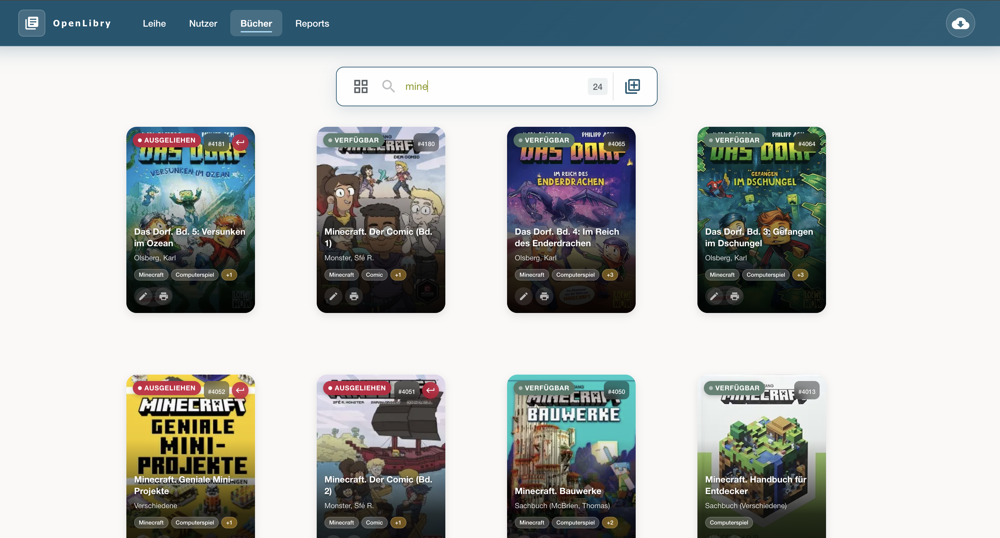

# BSWG-OpenLibry

An adaptation of the [OpenLibry](https://github.com/jzakotnik/openlibry) library management system for the Brazos Spinners and Weavers Guild.

See [openlibry-dev-roadmap.md](openlibry-dev-roadmap.md) for the development plan.

---

## BSWG Specific Features

These features were added on top of the upstream OpenLibry codebase for the Brazos Spinners and Weavers Guild.

### Google SSO (Phase 1)

Authentication is handled through Google OAuth via NextAuth.js. Members log in with their Google Workspace accounts — no separate library password required. Login is restricted to authorized accounts. The `AUTH_ENABLED` environment variable controls whether authentication is enforced (set to `false` only during local development bootstrapping).

### Batch ISBN Import (Phase 2)

Staff can import the full book collection at once from a file of ISBNs collected by barcode scanner, rather than entering books one by one.

**Admin UI** — available at `/admin/import` (linked from the Administration dashboard):

- Accepts `.txt`, `.csv`, and `.xlsx`/`.xls` files in a single uploader
- **Plain text** (`.txt`): one ISBN per line — the simplest format for basic barcode scanner apps
- **CSV / Excel**: the importer detects which column contains ISBNs automatically. If the file has only one plausible ISBN column it proceeds silently; if multiple columns qualify it shows a one-step column picker with sample values so staff can confirm the right column
- **Quantity column**: if a column named `qty`, `quantity`, `copies`, `count`, or similar is detected, the importer creates that many separate book records per ISBN (useful when you own multiple copies of a title)
- Each ISBN is looked up through the full 5-source catalog chain (DNB, Google Books, Open Library, ISBNSearch, DNB portal fallback) for maximum coverage
- Cover images are fetched and attached automatically
- Any ISBNs not found in any catalog are collected and offered as a downloadable `failed-isbns.txt` for manual follow-up
- A **CSV template** can be downloaded directly from the import page (`isbn`, `quantity`, `notes` columns)

**CLI script** — for technical staff importing directly against the database:

```bash
node scripts/import-books.mjs my-isbn-list.txt
```

Reads one ISBN per line, queries the Open Library API, writes records directly via Prisma. Failed ISBNs are saved to `failed-isbns.txt`.

---

## Upstream: OpenLibry

**Simple, free library management software for schools**

[](https://github.com/jzakotnik/openlibry)
[](LICENSE)
[](https://hub.docker.com/r/jzakotnik/openlibry)

OpenLibry is a modern, user-friendly open-source solution for small libraries, especially in schools. The software was designed for the busy day-to-day environment where children check out, return, and manage books.

[](https://youtu.be/2UIFdA6Lqaw?si=5YP4eNZX5wCBMmBJ)

*▶️ Click the image to watch a 12-minute intro video*

---

## 🚀 Quickstart

Try OpenLibry in seconds with Docker:

```bash
docker run --rm -p 3000:3000 \
  --name openlibry \
  -e NEXTAUTH_SECRET=wunschpunsch \
  -e SECURITY_HEADERS=insecure \
  -e COVERIMAGE_FILESTORAGE_PATH=/app/database \
  jzakotnik/openlibry:release
```

Open [http://localhost:3000](http://localhost:3000) — done!

> ⚠️ **Note**: This is intended for evaluation only. Data will be lost when the container stops. For a production installation, see the [installation guide](https://openlibry.de/site/installation/).

---

## ✨ Features

| Feature | Description |
|---------|-------------|
| **Platform-independent** | Runs on desktop, tablet, and smartphone |
| **Smart search** | Real-time results as you type |
| **Barcode support** | Optimized for fast check-out with a scanner |
| **Cover images** | Automatic import of book cover art |
| **Flexible installation** | Raspberry Pi, Docker, or cloud |
| **Data import** | Import from OpenBiblio and Excel |

---

## 📸 Screenshots

<table>
  <tr>
    <td><br/><em>Start screen</em></td>
    <td><br/><em>Check-out screen</em></td>
  </tr>
  <tr>
    <td><br/><em>Book management</em></td>
    <td><br/><em>Edit book</em></td>
  </tr>
</table>

---

## 📖 Documentation

Full documentation is available at **[openlibry.de/site](https://openlibry.de/site/)**

| Topic | Description |
|-------|-------------|
| [🔧 Installation](https://openlibry.de/site/installation/) | Raspberry Pi, Docker, nginx |
| [⚙️ Configuration](https://openlibry.de/site/configuration/) | Loan periods, labels, overdue notices |
| [📖 User guide](https://openlibry.de/site/user-guide/) | Day-to-day use of OpenLibry |
| [🔄 Import/Export](https://openlibry.de/site/import/) | Migrate and back up data |
| [🛠️ API & Development](https://openlibry.de/site/development/) | For developers |

---

## 🤝 Contributing & Support

OpenLibry grew out of a primary school's need and is maintained by volunteers.

**Want to help?**

- 🐛 [Report issues](https://github.com/jzakotnik/openlibry/issues) – bugs or feature requests
- 💻 [Pull requests](https://github.com/jzakotnik/openlibry/pulls) – contribute code
- 📧 [info@openlibry.de](mailto:info@openlibry.de) – questions & hosting support
- ☕ [Ko-Fi](https://ko-fi.com/jzakotnik) – support the project financially

---

<p align="center">
  <strong>OpenLibry</strong> – Built with ❤️ for school libraries and volunteers
</p>
